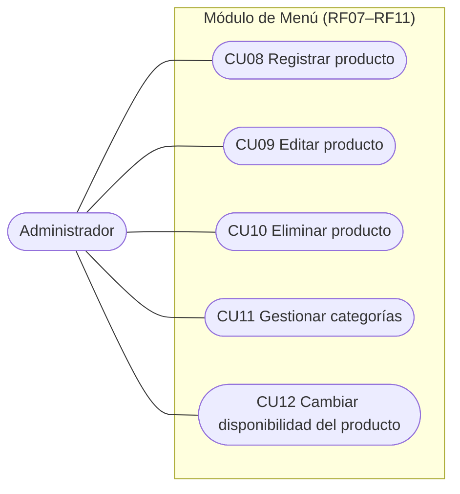
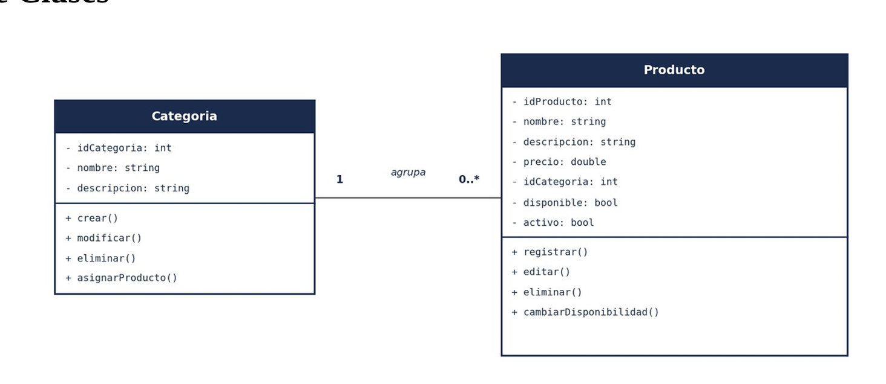
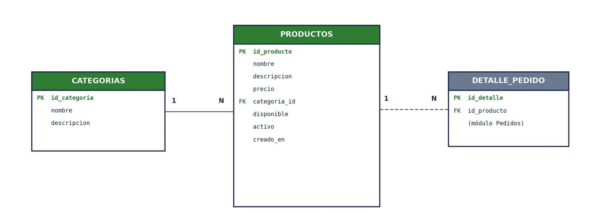

# Modelado — Módulo Menú (RF07 – RF11)

Responsable: Omar Rivera

El módulo Menú permite al administrador mantener el catálogo de productos del restaurante: registrar, editar y eliminar productos, organizarlos en categorías y controlar su disponibilidad. Los productos del menú son la base de los pedidos del módulo Pedidos (RF17–RF22): un producto marcado como no disponible no puede agregarse a un pedido (RF18).

| Dato | Valor |
|---|---|
| Requerimientos | RF07 – RF11 |
| Casos de uso | CU08 – CU12 |
| Historias de usuario | HU08 – HU12 |
| Actor principal | Administrador |
| Horas estimadas | 25 h (6 + 5 + 4 + 6 + 4) |
| Incremento | 2 (semanas 3–4) |

## Diagrama de casos de uso

## Diagrama de clases

## Modelo entidad-relación

La tabla `productos` referencia a `categorias` (una categoría agrupa muchos productos) y es referenciada por `detalle_pedido` del módulo Pedidos (un producto puede aparecer en muchos detalles de pedido).

