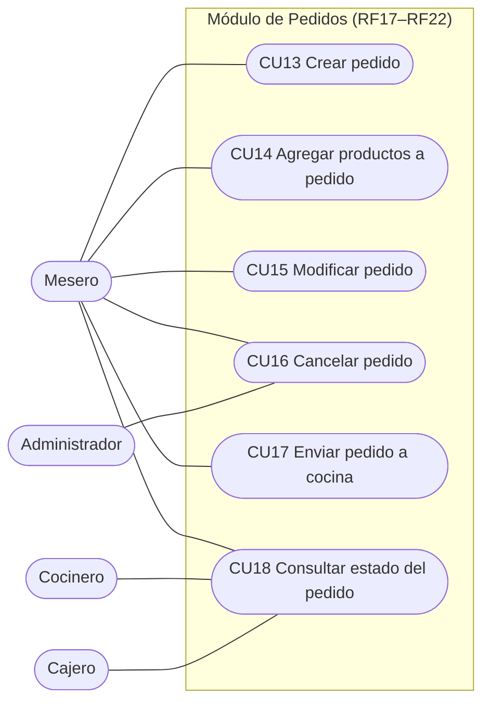
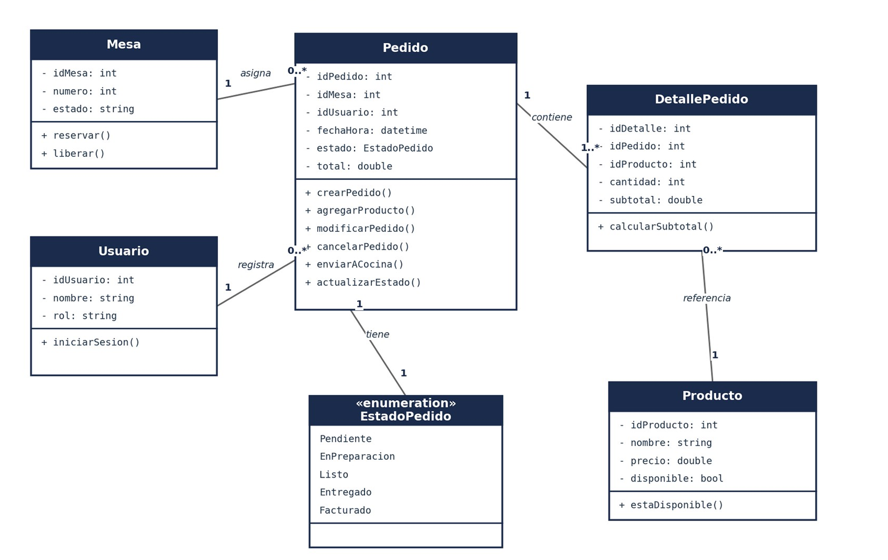
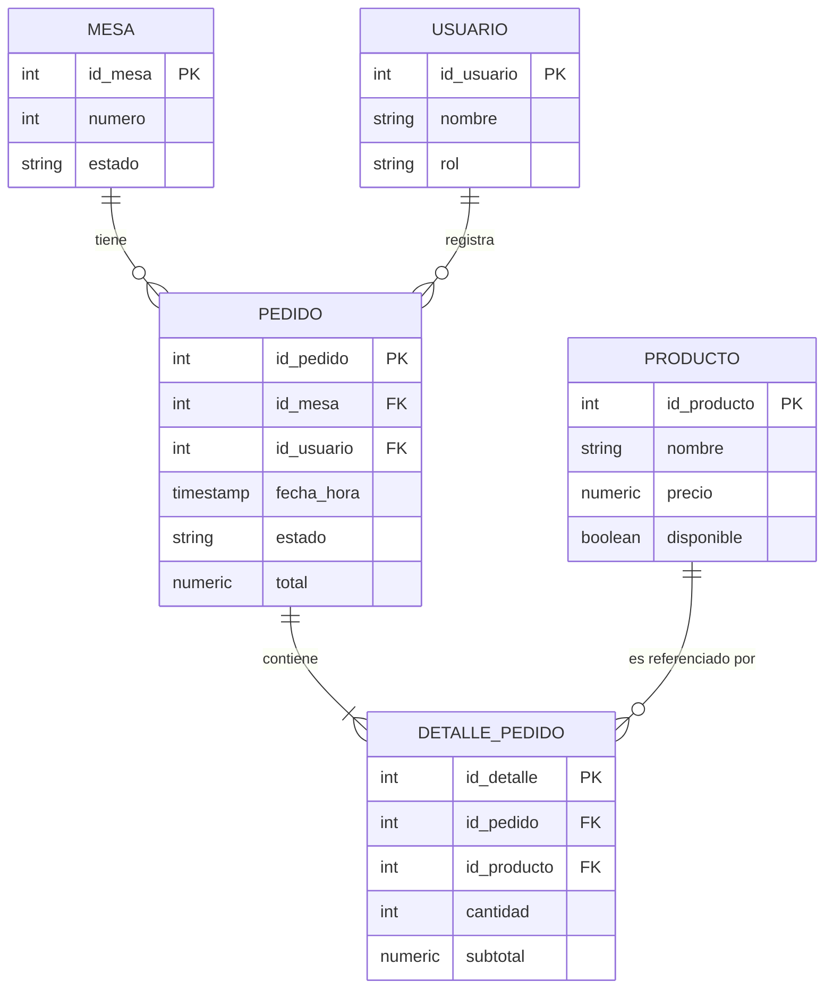

# Modelado — Módulo Pedidos (RF17 – RF22)

Responsable: Andrés Felipe Reyes (Líder de Modelado)

El módulo Pedidos permite al mesero registrar y dar seguimiento a los pedidos de cada mesa: crearlos, agregarles o modificarles productos, cancelarlos, enviarlos a cocina y consultar su estado hasta que se facturan. Se integra con los módulos de Mesas, Menú (productos) y Usuarios (mesero que registra el pedido).

| Dato | Valor |
|---|---|
| Requerimientos | RF17 – RF22 |
| Casos de uso | CU13 – CU18 |
| Historias de usuario | HU13 – HU18 |
| Actores | Mesero, Cocinero, Cajero, Administrador |
| Horas estimadas | 34 h (8 + 5 + 6 + 4 + 6 + 5) |
| Incremento | 3 (semanas 5–6) |

## Diagrama de casos de uso

El Mesero interviene en los seis casos de uso; el Cocinero y el Cajero consultan el estado del pedido (CU18) y el Administrador puede también cancelar pedidos (CU16).

## Diagrama de clases

La clase central es `Pedido`: se relaciona con `Mesa` (una mesa puede tener muchos pedidos a lo largo del tiempo) y con `Usuario` (un mesero registra muchos pedidos); se compone de `DetallePedido` (uno o más detalles, cada uno referencia un `Producto` del módulo Menú); y la enumeración `EstadoPedido` modela los estados Pendiente, En preparación, Listo, Entregado y Facturado.

## Modelo entidad-relación

Las tablas `mesa` y `usuario` se relacionan 1 a N con `pedido`; `pedido` se relaciona 1 a N con `detalle_pedido`, que a su vez referencia `producto` mediante una llave foránea (N a 1), de modo que un mismo producto puede aparecer en detalles de distintos pedidos.

## Conclusiones

- El módulo de Pedidos (RF17–RF22) queda especificado a nivel de requerimientos, con historias de usuario y casos de uso formales, listos para guiar su implementación en los siguientes cortes.
- Como Líder de Modelado se entregan los tres artefactos de modelado del primer corte (casos de uso, clases y entidad-relación) para el módulo asignado, coherentes entre sí y conectados con los módulos de Mesas, Menú y Usuarios.
- Se identificaron dos patrones de diseño (State y Observer) justificados por las reglas de negocio de RF20, RF21 y RF22, que se implementarán en el siguiente corte (ver [07-patrones-diseno.md](07-patrones-diseno.md)).
