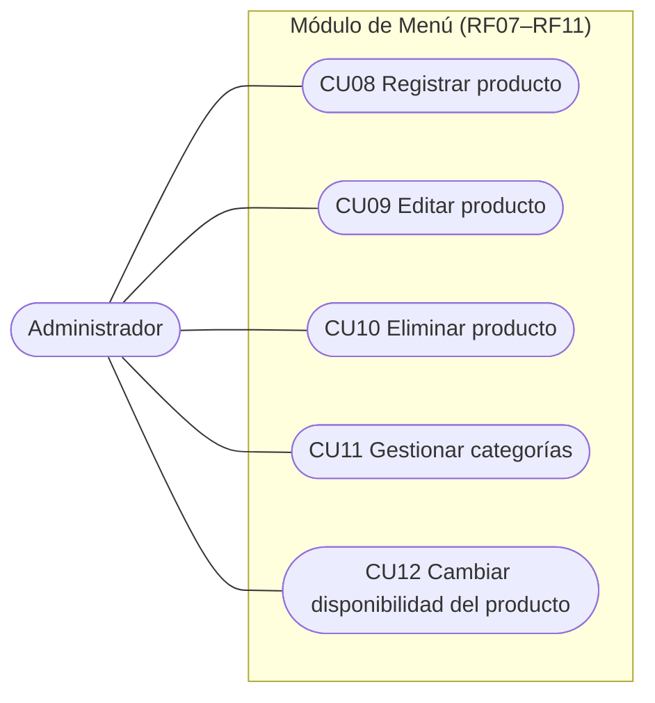
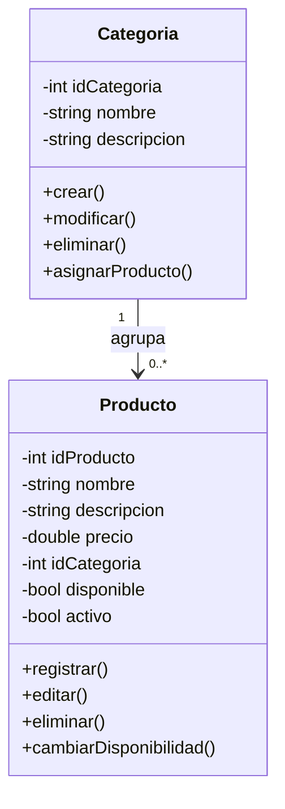
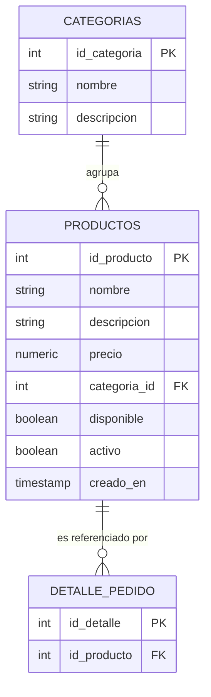

# Módulo Menú (RF07 – RF11)

> Proyecto **SIAR** — Sistema Integral de Administración para Restaurantes · Primer corte (documentación y modelado).
> Módulo asignado al **Integrante 2: Omar Rivera** (Líder de Ingeniería de Requerimientos).

## 1. Descripción

El módulo Menú permite al administrador mantener el catálogo de productos del restaurante: registrar, editar y eliminar productos, organizarlos en categorías y controlar su disponibilidad. Los productos del menú son la base de los pedidos del módulo Pedidos (RF17–RF22): un producto marcado como no disponible no puede agregarse a un pedido (RF18).

| Dato | Valor |
|---|---|
| Requerimientos | RF07 – RF11 |
| Casos de uso | CU08 – CU12 |
| Historias de usuario | HU08 – HU12 |
| Actor principal | Administrador |
| Horas estimadas | 25 h (6 + 5 + 4 + 6 + 4) |
| Incremento | 2 (semanas 3–4) |

## 2. Requerimientos funcionales

| ID | Nombre | Descripción | Módulo | Prioridad | HU | CU |
|---|---|---|---|---|---|---|
| RF07 | Registrar producto | El sistema permite al administrador registrar productos del menú con nombre, precio y categoría, validando la información ingresada. | Menú | Must | HU-08 | CU-08 |
| RF08 | Editar producto | El sistema permite al administrador consultar los productos existentes y modificar sus datos (nombre, descripción, precio y categoría). | Menú | Must | HU-09 | CU-09 |
| RF09 | Eliminar producto | El sistema permite al administrador eliminar productos del menú, con confirmación previa. Si el producto tiene pedidos asociados, se desactiva en lugar de eliminarse. | Menú | Should | HU-10 | CU-10 |
| RF10 | Gestionar categorías | El sistema permite crear, modificar y eliminar categorías, y asignar productos a ellas. No se elimina una categoría con productos asociados. | Menú | Should | HU-11 | CU-11 |
| RF11 | Cambiar disponibilidad | El sistema permite al administrador marcar un producto como disponible o no disponible, y el cambio se refleja en el menú. | Menú | Must | HU-12 | CU-12 |

_Prioridad MoSCoW: Must = obligatorio · Should = importante pero no crítico._

Observaciones:

- RF07, RF08 y RF11 son Must porque sin ellos no es posible armar el menú ni operar los pedidos; RF09 y RF10 son Should.
- Cada RF tiene una historia de usuario y un caso de uso asociados (relación 1 a 1).
- RF11 se relaciona con RF18 (Agregar productos a un pedido existente): un producto no disponible no puede agregarse a un pedido.
- RF09 aplica baja lógica cuando el producto ya fue usado en pedidos, para conservar el historial de ventas.

## 3. Historias de usuario

### HU08 — Registrar producto

**Como** administrador  
**Quiero** registrar nuevos productos en el menú  
**Para** que estén disponibles para ser agregados a los pedidos

**Criterios de aceptación:**

- El formulario solicita: nombre, descripción (opcional), precio y categoría
- El nombre del producto debe ser único en el sistema
- El precio debe ser un valor numérico mayor que cero
- La categoría se selecciona de la lista de categorías existentes
- El producto se registra por defecto como disponible
- El sistema confirma el registro exitoso
- Si faltan datos obligatorios o son inválidos, el sistema muestra un error

**Prioridad:** Alta · **RF asociado:** RF07 · **Estimación:** 6 horas

### HU09 — Editar producto

**Como** administrador  
**Quiero** modificar los datos de un producto existente  
**Para** mantener el menú actualizado (precios, nombres y categorías)

**Criterios de aceptación:**

- El sistema muestra la lista de productos registrados
- Se puede seleccionar un producto para editar
- Se pueden modificar: nombre, descripción, precio y categoría
- Si se cambia el nombre, debe validarse que no exista otro producto igual
- El sistema valida la información modificada antes de guardar
- Los cambios de precio no alteran los pedidos ya facturados
- El sistema confirma la actualización exitosa

**Prioridad:** Alta · **RF asociado:** RF08 · **Estimación:** 5 horas

### HU10 — Eliminar producto

**Como** administrador  
**Quiero** eliminar productos del menú  
**Para** retirar los platos o bebidas que el restaurante ya no ofrece

**Criterios de aceptación:**

- El sistema muestra la lista de productos registrados
- Se puede seleccionar un producto para eliminar
- El sistema pide confirmación antes de eliminar
- Si el producto tiene pedidos asociados, se desactiva en lugar de eliminarse
- El producto eliminado o desactivado deja de aparecer en el menú
- El sistema confirma la eliminación exitosa

**Prioridad:** Media · **RF asociado:** RF09 · **Estimación:** 4 horas

### HU11 — Gestionar categorías

**Como** administrador  
**Quiero** crear y administrar las categorías del menú  
**Para** organizar los productos (entradas, platos fuertes, bebidas, postres)

**Criterios de aceptación:**

- El sistema permite crear categorías nuevas
- Cada categoría tiene un nombre único
- Se pueden asignar productos a una categoría
- Se puede modificar el nombre y la descripción de una categoría
- No se puede eliminar una categoría que tenga productos asociados
- El sistema confirma cada operación exitosa

**Prioridad:** Media · **RF asociado:** RF10 · **Estimación:** 6 horas

### HU12 — Cambiar disponibilidad del producto

**Como** administrador  
**Quiero** marcar un producto como disponible o no disponible  
**Para** evitar que los meseros ofrezcan productos agotados durante el servicio

**Criterios de aceptación:**

- El sistema permite seleccionar un producto de la lista
- El estado de disponibilidad puede ser: disponible o no disponible
- El cambio se guarda en la base de datos
- El cambio se refleja de inmediato en el menú
- Un producto no disponible no puede agregarse a un pedido (RF18)
- El sistema confirma el cambio exitoso

**Prioridad:** Alta · **RF asociado:** RF11 · **Estimación:** 4 horas

## 4. Casos de uso

### CU08 — Registrar producto

| | |
|---|---|
| **Actor principal** | Administrador |
| **Actores secundarios** | Base de datos |
| **Precondiciones** | El administrador ha iniciado sesión con rol Administrador y existe al menos una categoría registrada |
| **Postcondiciones** | El nuevo producto queda registrado y disponible en el menú |
| **RF asociado** | RF07 |

**Flujo normal:**

1. El administrador ingresa al módulo de gestión de menú.
2. Selecciona la opción "Registrar nuevo producto".
3. El sistema muestra el formulario de registro.
4. El administrador ingresa: nombre, descripción, precio y categoría.
5. El administrador confirma el registro.
6. El sistema valida la información ingresada.
7. El sistema asigna el producto a la categoría seleccionada.
8. El sistema registra el producto en la base de datos.
9. El sistema muestra un mensaje de confirmación exitoso.

**Flujos alternativos:**

- 6a. Algún campo obligatorio está vacío → el sistema muestra "Todos los campos obligatorios deben completarse".
- 6b. El precio no es un número mayor que cero → el sistema muestra "El precio debe ser mayor que cero".
- 6c. Ya existe un producto con ese nombre → el sistema muestra "El producto ya está registrado".

**Excepciones:** Si la base de datos no responde, el sistema muestra "Error al conectar con la base de datos".

### CU09 — Editar producto

| | |
|---|---|
| **Actor principal** | Administrador |
| **Actores secundarios** | Base de datos |
| **Precondiciones** | El administrador ha iniciado sesión y existe al menos un producto registrado |
| **Postcondiciones** | Los datos del producto quedan actualizados en la base de datos |
| **RF asociado** | RF08 |

**Flujo normal:**

1. El administrador ingresa al módulo de gestión de menú.
2. El sistema muestra la lista de productos existentes.
3. El administrador selecciona un producto.
4. El sistema muestra el formulario con los datos actuales.
5. El administrador modifica los campos deseados (nombre, descripción, precio o categoría).
6. El sistema valida la información modificada.
7. El sistema guarda los cambios en la base de datos.
8. El sistema muestra un mensaje de actualización exitosa.

**Flujos alternativos:**

- 6a. El nuevo nombre ya existe en otro producto → el sistema muestra "El producto ya está registrado".
- 6b. El precio no es válido → el sistema muestra "El precio debe ser mayor que cero".
- 5a. No se modificó ningún campo → el sistema muestra "No hay cambios para guardar".

**Excepciones:** Si la base de datos no responde, el sistema muestra "Error al conectar con la base de datos".

### CU10 — Eliminar producto

| | |
|---|---|
| **Actor principal** | Administrador |
| **Actores secundarios** | Base de datos |
| **Precondiciones** | El administrador ha iniciado sesión y existe al menos un producto registrado |
| **Postcondiciones** | El producto queda eliminado o desactivado y deja de aparecer en el menú |
| **RF asociado** | RF09 |

**Flujo normal:**

1. El administrador ingresa al módulo de gestión de menú.
2. El sistema muestra la lista de productos existentes.
3. El administrador selecciona un producto.
4. El administrador solicita su eliminación.
5. El sistema solicita confirmación antes de proceder.
6. El administrador confirma la eliminación.
7. El sistema verifica si el producto tiene pedidos asociados.
8. Si no tiene pedidos, el sistema actualiza la base de datos eliminando el producto.
9. El sistema muestra un mensaje de eliminación exitosa.

**Flujos alternativos:**

- 7a. El producto tiene pedidos asociados → el sistema lo desactiva en lugar de eliminarlo y muestra "El producto fue desactivado porque tiene pedidos asociados".
- 6a. El administrador cancela la confirmación → el sistema no realiza cambios.

**Excepciones:** Si la base de datos no responde, el sistema muestra "Error al conectar con la base de datos".

### CU11 — Gestionar categorías

| | |
|---|---|
| **Actor principal** | Administrador |
| **Actores secundarios** | Base de datos |
| **Precondiciones** | El administrador ha iniciado sesión con rol Administrador |
| **Postcondiciones** | Las categorías del menú quedan creadas, modificadas o eliminadas, con sus productos asignados |
| **RF asociado** | RF10 |

**Flujo normal:**

1. El administrador ingresa al módulo de gestión de categorías.
2. El sistema muestra la lista de categorías existentes.
3. El administrador selecciona "Crear nueva categoría" o selecciona una existente.
4. El administrador ingresa o modifica el nombre y la descripción de la categoría.
5. El administrador asigna o retira productos de la categoría, si corresponde.
6. El administrador confirma la operación.
7. El sistema valida que el nombre de la categoría sea único.
8. El sistema guarda los cambios en la base de datos.
9. El sistema muestra un mensaje de confirmación exitoso.

**Flujos alternativos:**

- 7a. El nombre de la categoría ya existe → el sistema muestra "La categoría ya existe".
- 3a. El administrador intenta eliminar una categoría con productos asociados → el sistema muestra "No se puede eliminar una categoría con productos asociados".

**Excepciones:** Si la base de datos no responde, el sistema muestra "Error al conectar con la base de datos".

### CU12 — Cambiar disponibilidad del producto

| | |
|---|---|
| **Actor principal** | Administrador |
| **Actores secundarios** | Base de datos |
| **Precondiciones** | El administrador ha iniciado sesión y existe al menos un producto registrado |
| **Postcondiciones** | El producto queda marcado como disponible o no disponible, y el menú refleja el cambio |
| **RF asociado** | RF11 |

**Flujo normal:**

1. El administrador ingresa al módulo de gestión de menú.
2. El sistema muestra la lista de productos con su estado de disponibilidad.
3. El administrador selecciona un producto.
4. El administrador cambia el estado de disponibilidad (disponible / no disponible).
5. El administrador confirma el cambio.
6. El sistema guarda el cambio en la base de datos.
7. El sistema refleja el nuevo estado en el menú.
8. El sistema muestra un mensaje de confirmación exitoso.

**Flujos alternativos:**

- 4a. El administrador selecciona el mismo estado que ya tenía → el sistema muestra "El producto ya se encuentra en ese estado".

**Excepciones:** Si la base de datos no responde, el sistema muestra "Error al conectar con la base de datos".

## 5. Matriz de trazabilidad

| RF | Nombre | HU | CU | Módulo | Responsable | Prueba planificada |
|---|---|---|---|---|---|---|
| RF07 | Registrar producto | HU-08 | CU-08 | Menú | Omar Rivera | test_registrar_producto |
| RF08 | Editar producto | HU-09 | CU-09 | Menú | Omar Rivera | test_editar_producto |
| RF09 | Eliminar producto | HU-10 | CU-10 | Menú | Omar Rivera | test_eliminar_producto |
| RF10 | Gestionar categorías | HU-11 | CU-11 | Menú | Omar Rivera | test_gestionar_categorias |
| RF11 | Cambiar disponibilidad | HU-12 | CU-12 | Menú | Omar Rivera | test_cambiar_disponibilidad |

## 6. Modelado

### 6.1 Diagrama de casos de uso



### 6.2 Diagrama de clases



### 6.3 Modelo entidad-relación

La tabla `productos` referencia a `categorias` (una categoría agrupa muchos productos) y es referenciada por `detalle_pedido` del módulo Pedidos (un producto puede aparecer en muchos detalles de pedido).



## 7. Código SQL

```sql
-- Tabla categorias
CREATE TABLE categorias (
  id_categoria SERIAL PRIMARY KEY,
  nombre VARCHAR(50) UNIQUE NOT NULL,
  descripcion VARCHAR(200)
);

-- Tabla productos
CREATE TABLE productos (
  id_producto SERIAL PRIMARY KEY,
  nombre VARCHAR(100) UNIQUE NOT NULL,
  descripcion TEXT,
  precio NUMERIC(10,2) NOT NULL CHECK (precio > 0),
  categoria_id INT NOT NULL REFERENCES categorias(id_categoria),
  disponible BOOLEAN DEFAULT TRUE,
  activo BOOLEAN DEFAULT TRUE,
  creado_en TIMESTAMP DEFAULT NOW()
);

-- Índices
CREATE INDEX idx_productos_categoria ON productos(categoria_id);
CREATE INDEX idx_productos_disponible ON productos(disponible);

-- Datos iniciales de categorías
INSERT INTO categorias (nombre, descripcion) VALUES
  ('Entradas', 'Platos para comenzar'),
  ('Platos fuertes', 'Platos principales'),
  ('Bebidas', 'Bebidas frías y calientes'),
  ('Postres', 'Postres y dulces');
```

## 8. Diccionario de datos

### Tabla: `categorias`

| Campo | Tipo | Restricción | Descripción |
|---|---|---|---|
| `id_categoria` | SERIAL | PK | Identificador único de la categoría |
| `nombre` | VARCHAR(50) | UNIQUE, NOT NULL | Nombre de la categoría (Entradas, Bebidas, etc.) |
| `descripcion` | VARCHAR(200) | — | Descripción de la categoría |

### Tabla: `productos`

| Campo | Tipo | Restricción | Descripción |
|---|---|---|---|
| `id_producto` | SERIAL | PK | Identificador único del producto |
| `nombre` | VARCHAR(100) | UNIQUE, NOT NULL | Nombre del producto |
| `descripcion` | TEXT | — | Descripción del producto |
| `precio` | NUMERIC(10,2) | NOT NULL, CHECK > 0 | Precio de venta del producto |
| `categoria_id` | INT | FK → categorias(id_categoria) | Categoría a la que pertenece |
| `disponible` | BOOLEAN | DEFAULT TRUE | Indica si el producto puede pedirse en este momento |
| `activo` | BOOLEAN | DEFAULT TRUE | Indica si el producto sigue en el menú (baja lógica) |
| `creado_en` | TIMESTAMP | DEFAULT NOW() | Fecha de creación del producto |
