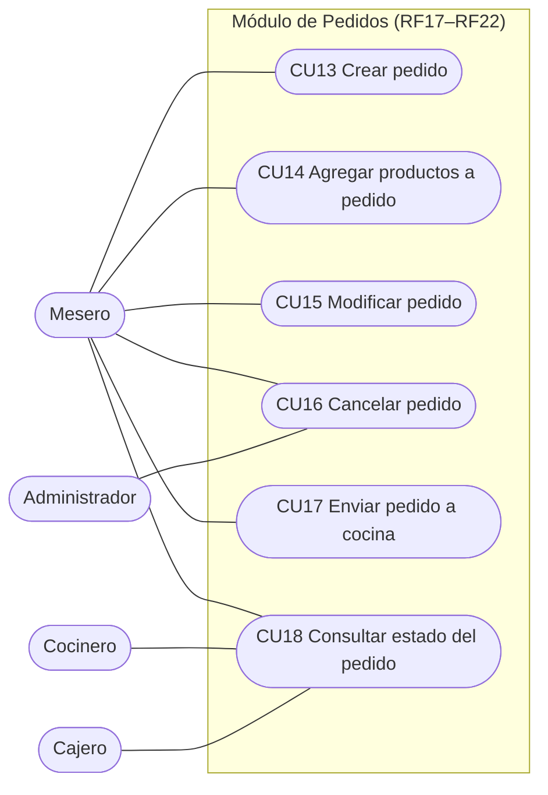
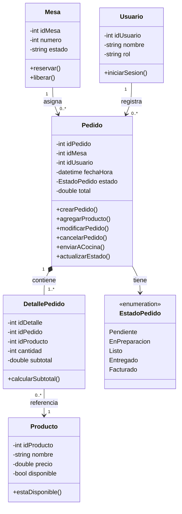
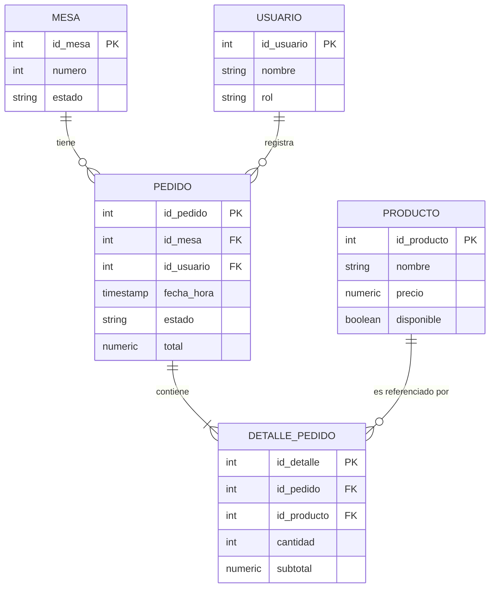

# Módulo Pedidos (RF17 – RF22) y Modelado

> Proyecto **SIAR** — Sistema Integral de Administración para Restaurantes · Primer corte (documentación y modelado).
> Módulo asignado al **Integrante 3: Andrés Felipe Reyes** (Líder de Modelado).

## 1. Descripción

El módulo Pedidos permite al mesero registrar y dar seguimiento a los pedidos de cada mesa: crearlos, agregarles o modificarles productos, cancelarlos, enviarlos a cocina y consultar su estado hasta que se facturan. Se integra con los módulos de Mesas, Menú (productos) y Usuarios (mesero que registra el pedido).

Además del módulo, el Integrante 3 es **Líder de Modelado**: este documento incluye los diagramas de casos de uso, de clases y entidad-relación del módulo, y la propuesta de patrones de diseño.

| Dato | Valor |
|---|---|
| Requerimientos | RF17 – RF22 |
| Casos de uso | CU13 – CU18 |
| Actores | Mesero, Cocinero, Cajero, Administrador |
| Horas estimadas | 34 h |
| Incremento | 3 (semanas 5–6) |

## 2. Requerimientos funcionales

| RF | CU | Actor(es) | Descripción | Horas |
|---|---|---|---|---|
| RF17 | CU13 | Mesero | Crear pedido | 8 |
| RF18 | CU14 | Mesero | Agregar productos a un pedido existente | 5 |
| RF19 | CU15 | Mesero | Modificar pedido | 6 |
| RF20 | CU16 | Mesero / Administrador | Cancelar pedido | 4 |
| RF21 | CU17 | Mesero | Enviar pedido a cocina | 6 |
| RF22 | CU18 | Mesero / Cocinero / Cajero | Consultar estado del pedido | 5 |
| **Total** |  |  |  | **34** |

## 3. Historias de usuario

### RF17 / CU13 — Crear pedido

Como mesero, quiero seleccionar una mesa y crear un pedido agregando los productos solicitados por el cliente, para registrar el consumo y enviarlo a cocina de forma organizada.

### RF18 / CU14 — Agregar productos a un pedido existente

Como mesero, quiero agregar productos a un pedido ya creado, para atender solicitudes adicionales del cliente sin tener que generar un nuevo pedido.

### RF19 / CU15 — Modificar pedido

Como mesero, quiero modificar las cantidades o productos de un pedido, para corregir errores o cambios solicitados por el cliente antes de que sea facturado.

### RF20 / CU16 — Cancelar pedido

Como mesero o administrador, quiero cancelar un pedido que aún no ha sido facturado, para liberar la mesa y corregir errores de registro.

### RF21 / CU17 — Enviar pedido a cocina

Como mesero, quiero confirmar y enviar el pedido a cocina, para que el cocinero reciba la notificación y comience la preparación de los productos.

### RF22 / CU18 — Consultar estado del pedido

Como mesero, cocinero o cajero, quiero consultar el estado actual de un pedido, para dar seguimiento a su progreso desde que se crea hasta que se factura.

## 4. Casos de uso detallados

### CU13 — Crear pedido

| | |
|---|---|
| **Actor(es)** | Mesero |
| **Precondiciones** | El mesero ha iniciado sesión en el sistema. La mesa seleccionada se encuentra disponible u ocupada por el mismo cliente. |
| **Postcondiciones** | Queda registrado un nuevo pedido en estado "Pendiente", asociado a la mesa y al mesero, visible para cocina. |
| **Flujo alterno** | Si la mesa no está disponible, el sistema notifica al mesero y no permite crear el pedido. |
| **RF asociado** | RF17 |

**Flujo normal:**

1. El mesero selecciona la mesa correspondiente.
2. El sistema crea un nuevo pedido asociado a esa mesa.
3. El mesero agrega uno o varios productos del menú al pedido.
4. El mesero confirma el pedido.
5. El sistema envía el pedido a cocina y cambia su estado a "Pendiente".

### CU14 — Agregar productos a un pedido existente

| | |
|---|---|
| **Actor(es)** | Mesero |
| **Precondiciones** | Existe un pedido activo (no facturado ni cancelado) asociado a la mesa. |
| **Postcondiciones** | El pedido queda actualizado con los nuevos productos y su total recalculado. |
| **Flujo alterno** | Si algún producto no está disponible, el sistema lo informa y no lo agrega al pedido. |
| **RF asociado** | RF18 |

**Flujo normal:**

1. El mesero selecciona el pedido existente.
2. El mesero agrega uno o más productos nuevos.
3. El sistema valida la disponibilidad de cada producto.
4. El sistema actualiza el total del pedido.
5. El sistema guarda los cambios.

### CU15 — Modificar pedido

| | |
|---|---|
| **Actor(es)** | Mesero |
| **Precondiciones** | El pedido existe y no ha sido facturado. |
| **Postcondiciones** | El pedido refleja los productos y cantidades actualizados, con su total recalculado. |
| **Flujo alterno** | Si el pedido ya fue facturado, el sistema rechaza la modificación. |
| **RF asociado** | RF19 |

**Flujo normal:**

1. El mesero consulta el pedido.
2. El mesero modifica productos o cantidades.
3. El sistema valida que los cambios sean consistentes (disponibilidad, cantidades válidas).
4. El sistema actualiza el total del pedido.
5. El sistema guarda los cambios.

### CU16 — Cancelar pedido

| | |
|---|---|
| **Actor(es)** | Mesero / Administrador |
| **Precondiciones** | El pedido existe y no ha sido facturado. |
| **Postcondiciones** | El pedido queda marcado como cancelado y la mesa asociada vuelve a estar disponible. |
| **Flujo alterno** | Si el pedido ya fue facturado, el sistema impide la cancelación e informa al usuario. |
| **RF asociado** | RF20 |

**Flujo normal:**

1. El usuario consulta el pedido.
2. El usuario solicita la cancelación.
3. El sistema valida que el pedido no esté facturado.
4. El sistema solicita confirmación.
5. El usuario confirma la cancelación.
6. El sistema actualiza el estado del pedido a "Cancelado" y libera la mesa.

### CU17 — Enviar pedido a cocina

| | |
|---|---|
| **Actor(es)** | Mesero |
| **Precondiciones** | El pedido contiene al menos un producto. El pedido se encuentra en estado "Pendiente". |
| **Postcondiciones** | El cocinero recibe la notificación del nuevo pedido y el estado queda en "En preparación". |
| **Flujo alterno** | Si el pedido no tiene productos agregados, el sistema no permite enviarlo a cocina. |
| **RF asociado** | RF21 |

**Flujo normal:**

1. El mesero confirma el pedido.
2. El sistema envía el pedido a cocina.
3. El sistema notifica al cocinero.
4. El sistema cambia el estado del pedido a "En preparación".

### CU18 — Consultar estado del pedido

| | |
|---|---|
| **Actor(es)** | Mesero / Cocinero / Cajero |
| **Precondiciones** | El pedido existe en el sistema. |
| **Postcondiciones** | El usuario conoce el estado real del pedido y, si corresponde, el estado queda actualizado. |
| **Flujo alterno** | Si el pedido no existe o fue eliminado, el sistema informa que no se encontró el registro. |
| **RF asociado** | RF22 |

**Flujo normal:**

1. El usuario consulta el pedido.
2. El sistema muestra el estado actual (Pendiente, En preparación, Listo, Entregado o Facturado).
3. El usuario (según su rol) actualiza el estado conforme avanza la preparación o entrega.

## 5. Matriz de trazabilidad

| RF | Nombre | CU | Módulo | Responsable |
|---|---|---|---|---|
| RF17 | Crear pedido | CU13 | Pedidos | Andrés Felipe Reyes |
| RF18 | Agregar productos a un pedido existente | CU14 | Pedidos | Andrés Felipe Reyes |
| RF19 | Modificar pedido | CU15 | Pedidos | Andrés Felipe Reyes |
| RF20 | Cancelar pedido | CU16 | Pedidos | Andrés Felipe Reyes |
| RF21 | Enviar pedido a cocina | CU17 | Pedidos | Andrés Felipe Reyes |
| RF22 | Consultar estado del pedido | CU18 | Pedidos | Andrés Felipe Reyes |

## 6. Modelado del sistema

### 6.1 Diagrama de casos de uso

El Mesero interviene en los seis casos de uso; el Cocinero y el Cajero consultan el estado del pedido (CU18) y el Administrador puede también cancelar pedidos (CU16).



### 6.2 Diagrama de clases

La clase central es `Pedido`: se relaciona con `Mesa` (una mesa puede tener muchos pedidos a lo largo del tiempo) y con `Usuario` (un mesero registra muchos pedidos); se compone de `DetallePedido` (uno o más detalles, cada uno referencia un `Producto` del módulo Menú); y la enumeración `EstadoPedido` modela los estados Pendiente, En preparación, Listo, Entregado y Facturado.



### 6.3 Modelo entidad-relación

Las tablas `mesa` y `usuario` se relacionan 1 a N con `pedido`; `pedido` se relaciona 1 a N con `detalle_pedido`, que a su vez referencia `producto` mediante una llave foránea (N a 1), de modo que un mismo producto puede aparecer en detalles de distintos pedidos.



### 6.4 Código SQL

Script de creación de las tablas del módulo (PostgreSQL 15). Las tablas `mesas`, `usuarios` y `productos` pertenecen a los módulos de Mesas, Usuarios y Menú.

```sql
-- Dependencias: usuarios (módulo Usuarios), productos (módulo Menú)
-- y mesas (módulo Mesas) deben existir antes de crear estas tablas.

-- Tabla pedidos
CREATE TABLE pedidos (
  id_pedido SERIAL PRIMARY KEY,
  id_mesa INT NOT NULL REFERENCES mesas(id_mesa),
  id_usuario INT NOT NULL REFERENCES usuarios(id_usuario),
  fecha_hora TIMESTAMP DEFAULT NOW(),
  estado VARCHAR(20) NOT NULL DEFAULT 'Pendiente'
    CHECK (estado IN ('Pendiente','En preparación','Listo',
                      'Entregado','Facturado','Cancelado')),
  total NUMERIC(10,2) NOT NULL DEFAULT 0 CHECK (total >= 0)
);

-- Tabla detalle_pedido
CREATE TABLE detalle_pedido (
  id_detalle SERIAL PRIMARY KEY,
  id_pedido INT NOT NULL REFERENCES pedidos(id_pedido) ON DELETE CASCADE,
  id_producto INT NOT NULL REFERENCES productos(id_producto),
  cantidad INT NOT NULL CHECK (cantidad > 0),
  subtotal NUMERIC(10,2) NOT NULL CHECK (subtotal >= 0)
);

-- Índices
CREATE INDEX idx_pedidos_mesa ON pedidos(id_mesa);
CREATE INDEX idx_pedidos_estado ON pedidos(estado);
CREATE INDEX idx_detalle_pedido ON detalle_pedido(id_pedido);
```

### 6.5 Diccionario de datos

**Tabla: `pedidos`**

| Campo | Tipo | Restricción | Descripción |
|---|---|---|---|
| `id_pedido` | SERIAL | PK | Identificador único del pedido |
| `id_mesa` | INT | FK → mesas(id_mesa), NOT NULL | Mesa a la que pertenece el pedido |
| `id_usuario` | INT | FK → usuarios(id_usuario), NOT NULL | Mesero que registró el pedido |
| `fecha_hora` | TIMESTAMP | DEFAULT NOW() | Fecha y hora de creación del pedido |
| `estado` | VARCHAR(20) | NOT NULL, DEFAULT 'Pendiente', CHECK | Estado: Pendiente, En preparación, Listo, Entregado, Facturado o Cancelado |
| `total` | NUMERIC(10,2) | NOT NULL, DEFAULT 0, CHECK >= 0 | Total del pedido (suma de subtotales) |

**Tabla: `detalle_pedido`**

| Campo | Tipo | Restricción | Descripción |
|---|---|---|---|
| `id_detalle` | SERIAL | PK | Identificador único del detalle |
| `id_pedido` | INT | FK → pedidos(id_pedido), NOT NULL | Pedido al que pertenece el detalle |
| `id_producto` | INT | FK → productos(id_producto), NOT NULL | Producto solicitado |
| `cantidad` | INT | NOT NULL, CHECK > 0 | Unidades solicitadas del producto |
| `subtotal` | NUMERIC(10,2) | NOT NULL, CHECK >= 0 | Valor de la línea (cantidad × precio al momento del pedido) |

> Nota: el estado `Cancelado` se incluye en la restricción CHECK porque CU16 (Cancelar pedido) lo utiliza, aunque no aparece en la enumeración `EstadoPedido` del diagrama de clases.

## 7. Patrones de diseño aplicados

### 7.1 Patrón State — gestión del estado del pedido (RF22)

- **Problema:** El pedido transita por varios estados (Pendiente, En preparación, Listo, Entregado, Facturado) y, según el estado actual, ciertas acciones están permitidas o no (por ejemplo, no se puede cancelar un pedido ya facturado, RF20).
- **Solución propuesta:** Modelar cada estado como una clase que implementa una interfaz común `EstadoPedido`, con métodos como `avanzar()` o `cancelar()`. La clase `Pedido` delega en el objeto de estado actual el comportamiento permitido, en lugar de usar múltiples condicionales (`if`/`switch`) dispersos en el código.
- **Justificación:** Evita validaciones repetidas en cada método de `Pedido`, centraliza las reglas de transición de estado y facilita agregar nuevos estados sin modificar la lógica existente (principio abierto/cerrado).

### 7.2 Patrón Observer — notificación a cocina (RF21)

- **Problema:** Cuando el mesero confirma un pedido (RF21), el sistema debe notificar al cocinero sin que la clase `Pedido` necesite conocer los detalles de cómo se despliega esa notificación (pantalla de cocina, impresión de comanda, etc.).
- **Solución propuesta:** `Pedido` actúa como sujeto observable: al cambiar su estado a "En preparación", notifica a los observadores suscritos (por ejemplo, un `PanelCocinaObserver`) para que actualicen la vista de cocina en tiempo real.
- **Justificación:** Desacopla la lógica de negocio del pedido de la forma en que se presenta la notificación a cocina, permitiendo agregar nuevos canales (por ejemplo, una alerta sonora) sin modificar la clase `Pedido`.

## 8. Conclusiones

- El módulo de Pedidos (RF17–RF22) queda especificado a nivel de requerimientos, con historias de usuario y casos de uso formales, listos para guiar su implementación en los siguientes cortes.
- Como Líder de Modelado se entregan los tres artefactos de modelado del primer corte (casos de uso, clases y entidad-relación) para el módulo asignado, coherentes entre sí y conectados con los módulos de Mesas, Menú y Usuarios.
- Se identificaron dos patrones de diseño (State y Observer) justificados por las reglas de negocio de RF20, RF21 y RF22, que se implementarán en el siguiente corte.
