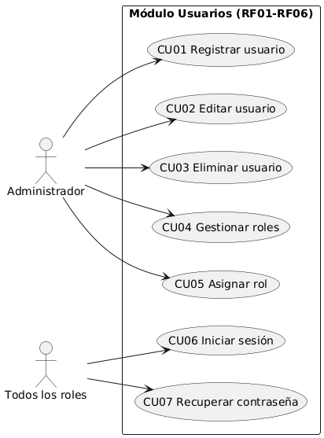
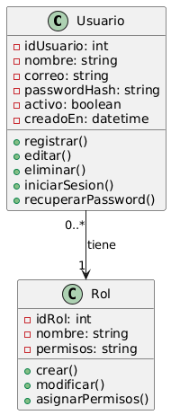
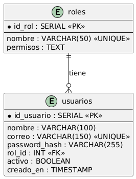

# Módulo Usuarios (RF01 – RF06)

> Proyecto **SIAR** — Sistema Integral de Administración para Restaurantes · Primer corte (documentación y modelado).
> Módulo asignado al **Integrante 1: Mónica Ortiz Ossa** (Líder de Documento de Inicio).

## 1. Descripción

El módulo Usuarios permite al administrador gestionar las cuentas del personal del restaurante: registrar, editar y eliminar usuarios, administrar los roles del sistema (Administrador, Cajero, Mesero, Cocinero) y asignarlos a cada usuario. Además, permite a cualquier usuario registrado iniciar sesión con autenticación JWT y recuperar su contraseña por correo. Es la base de seguridad del sistema: los demás módulos (Menú, Pedidos, etc.) dependen del rol del usuario autenticado para habilitar sus funciones.

| Dato | Valor |
|---|---|
| Requerimientos | RF01 – RF06 |
| Casos de uso | CU01 – CU07 |
| Historias de usuario | HU01 – HU07 |
| Actores | Administrador, Usuario registrado (cualquier rol) |
| Horas estimadas | 47 h (8 + 6 + 5 + 8 + 6 + 8 + 6) |
| Incremento | 1 (semanas 1–2) |

## 2. Requerimientos funcionales

| ID | Nombre | Descripción | Módulo | Prioridad | HU | CU |
|---|---|---|---|---|---|---|
| RF01 | Registrar usuario | El sistema permite al administrador crear nuevos usuarios con nombre, correo, contraseña y rol. La contraseña se almacena cifrada. | Usuarios | Must | HU-01 | CU-01 |
| RF02 | Editar usuario | El sistema permite al administrador modificar los datos de un usuario existente (nombre, correo, rol y estado). | Usuarios | Must | HU-02 | CU-02 |
| RF03 | Eliminar usuario | El sistema permite al administrador eliminar o desactivar usuarios. Si el usuario tiene registros asociados, se desactiva en lugar de eliminarse. | Usuarios | Must | HU-03 | CU-03 |
| RF04 | Gestionar roles | El sistema permite al administrador crear, modificar y asignar roles (Administrador, Cajero, Mesero, Cocinero), definiendo permisos para cada uno. | Usuarios | Must | HU-04, HU-05 | CU-04, CU-05 |
| RF05 | Iniciar sesión | El sistema permite a los usuarios registrados iniciar sesión con correo y contraseña, generando un token JWT y redirigiendo al dashboard según su rol. | Usuarios | Must | HU-06 | CU-06 |
| RF06 | Recuperar contraseña | El sistema permite a los usuarios recuperar su contraseña mediante un enlace enviado al correo registrado, con expiración de 30 minutos. | Usuarios | Should | HU-07 | CU-07 |

_Prioridad MoSCoW: Must = obligatorio · Should = importante pero no crítico._

Observaciones:

- Todos los RF del módulo son Must, excepto RF06 (Should).
- RF04 tiene 2 historias y 2 casos de uso asociados porque cubre dos acciones: gestionar roles y asignar roles.
- RF03 aplica baja lógica cuando el usuario tiene pedidos o registros asociados, para conservar el historial.

## 3. Historias de usuario

### HU01 — Registrar usuario

**Como** administrador  
**Quiero** registrar nuevos usuarios en el sistema  
**Para** que puedan acceder según su rol asignado

**Criterios de aceptación:**

- El formulario solicita: nombre completo, correo, contraseña y rol
- El correo debe ser único en el sistema
- La contraseña debe tener mínimo 8 caracteres
- La contraseña se almacena cifrada con bcrypt
- El rol se selecciona de la lista: Administrador, Cajero, Mesero, Cocinero
- El sistema confirma el registro exitoso
- Si el correo ya existe, el sistema muestra un error

**Prioridad:** Alta · **RF asociado:** RF01 · **Estimación:** 8 horas

### HU02 — Editar usuario

**Como** administrador  
**Quiero** editar los datos de un usuario existente  
**Para** mantener la información actualizada y corregir errores

**Criterios de aceptación:**

- El sistema muestra la lista de usuarios registrados
- Se puede seleccionar un usuario para editar
- Se pueden modificar: nombre, correo y rol
- Si se cambia el correo, debe validarse que no exista otro igual
- Se puede cambiar el estado del usuario (activo/inactivo)
- El sistema confirma la actualización exitosa
- Los cambios quedan registrados en la base de datos

**Prioridad:** Alta · **RF asociado:** RF02 · **Estimación:** 6 horas

### HU03 — Eliminar usuario

**Como** administrador  
**Quiero** eliminar o desactivar usuarios del sistema  
**Para** revocar el acceso de empleados que ya no laboran en el restaurante

**Criterios de aceptación:**

- El sistema muestra la lista de usuarios registrados
- Se puede seleccionar un usuario para eliminar
- El sistema pide confirmación antes de eliminar
- El usuario eliminado no puede volver a iniciar sesión
- Si el usuario tiene pedidos asociados, se desactiva en lugar de eliminarse
- El sistema confirma la eliminación exitosa
- Los cambios quedan registrados en la base de datos

**Prioridad:** Alta · **RF asociado:** RF03 · **Estimación:** 5 horas

### HU04 — Gestionar roles

**Como** administrador  
**Quiero** crear y administrar los roles del sistema  
**Para** definir qué permisos tiene cada tipo de usuario

**Criterios de aceptación:**

- El sistema permite crear roles nuevos
- Cada rol tiene un nombre único
- Se pueden asignar permisos específicos a cada rol
- Los roles predefinidos son: Administrador, Cajero, Mesero, Cocinero
- Se puede modificar el nombre y los permisos de un rol existente
- No se puede eliminar un rol que tenga usuarios asignados
- El sistema confirma cada operación exitosa

**Prioridad:** Alta · **RF asociado:** RF04 · **Estimación:** 8 horas

### HU05 — Asignar rol a usuario

**Como** administrador  
**Quiero** asignar o modificar el rol de un usuario  
**Para** controlar el acceso a las funciones del sistema según sus responsabilidades

**Criterios de aceptación:**

- El sistema muestra la lista de usuarios con su rol actual
- Se puede seleccionar un usuario y cambiar su rol
- El cambio de rol se refleja inmediatamente en los permisos del usuario
- El sistema valida que el rol exista
- El sistema confirma el cambio exitoso
- Los cambios quedan registrados en la base de datos
- El usuario afectado debe volver a iniciar sesión para que se apliquen los cambios

**Prioridad:** Alta · **RF asociado:** RF04 · **Estimación:** 6 horas

### HU06 — Iniciar sesión

**Como** usuario registrado (cualquier rol)  
**Quiero** iniciar sesión con mi correo y contraseña  
**Para** acceder a las funciones del sistema según mi rol

**Criterios de aceptación:**

- El formulario solicita correo y contraseña
- El sistema valida las credenciales contra la base de datos
- El sistema verifica que el usuario esté activo
- El sistema identifica el rol del usuario
- El sistema genera un token JWT con tiempo de expiración
- El sistema redirige al dashboard correspondiente al rol
- Si las credenciales son incorrectas, muestra un mensaje de error
- Si el usuario está inactivo, deniega el acceso

**Prioridad:** Alta · **RF asociado:** RF05 · **Estimación:** 8 horas

### HU07 — Recuperar contraseña

**Como** usuario registrado  
**Quiero** recuperar mi contraseña cuando la olvide  
**Para** poder volver a acceder al sistema sin ayuda del administrador

**Criterios de aceptación:**

- El formulario solicita el correo registrado
- El sistema valida que el correo exista en la base de datos
- El sistema envía un enlace o código de recuperación al correo
- El enlace tiene tiempo de expiración (ej. 30 minutos)
- El usuario puede establecer una nueva contraseña
- La nueva contraseña se valida (mínimo 8 caracteres)
- La nueva contraseña se almacena cifrada
- El sistema confirma el cambio exitoso

**Prioridad:** Media · **RF asociado:** RF06 · **Estimación:** 6 horas

## 4. Casos de uso

### CU01 — Registrar usuario

| | |
|---|---|
| **Actor principal** | Administrador |
| **Actores secundarios** | Base de datos |
| **Precondiciones** | El administrador ha iniciado sesión con rol Administrador |
| **Postcondiciones** | El nuevo usuario queda registrado y activo en el sistema |
| **RF asociado** | RF01 |

**Flujo normal:**

1. El administrador ingresa al módulo de gestión de usuarios.
2. Selecciona la opción "Registrar nuevo usuario".
3. El sistema muestra el formulario de registro.
4. El administrador ingresa: nombre completo, correo, contraseña y rol.
5. El administrador confirma el registro.
6. El sistema valida que el correo no esté registrado previamente.
7. El sistema cifra la contraseña con bcrypt.
8. El sistema guarda el usuario en la base de datos.
9. El sistema muestra un mensaje de confirmación exitoso.

**Flujos alternativos:**

- 6a. El correo ya existe → el sistema muestra "El correo ya está registrado" y vuelve al paso 4.
- 6b. Algún campo obligatorio está vacío → el sistema muestra "Todos los campos son obligatorios".
- 4a. La contraseña tiene menos de 8 caracteres → el sistema muestra "La contraseña debe tener mínimo 8 caracteres".

**Excepciones:** Si la base de datos no responde, el sistema muestra "Error al conectar con la base de datos".

### CU02 — Editar usuario

| | |
|---|---|
| **Actor principal** | Administrador |
| **Actores secundarios** | Base de datos |
| **Precondiciones** | El administrador ha iniciado sesión y existe al menos un usuario registrado |
| **Postcondiciones** | Los datos del usuario quedan actualizados en la base de datos |
| **RF asociado** | RF02 |

**Flujo normal:**

1. El administrador ingresa al módulo de gestión de usuarios.
2. El sistema muestra la lista de usuarios registrados.
3. El administrador selecciona un usuario.
4. El sistema muestra el formulario con los datos actuales.
5. El administrador modifica los campos deseados (nombre, correo, rol o estado).
6. El administrador confirma los cambios.
7. El sistema valida que el nuevo correo no esté en uso por otro usuario.
8. El sistema actualiza los datos en la base de datos.
9. El sistema muestra un mensaje de actualización exitosa.

**Flujos alternativos:**

- 7a. El nuevo correo ya existe → el sistema muestra "El correo ya está registrado por otro usuario".
- 6a. No se modificó ningún campo → el sistema muestra "No hay cambios para guardar".

**Excepciones:** Si la base de datos no responde, el sistema muestra "Error al conectar con la base de datos".

### CU03 — Eliminar usuario

| | |
|---|---|
| **Actor principal** | Administrador |
| **Actores secundarios** | Base de datos |
| **Precondiciones** | El administrador ha iniciado sesión y existe al menos un usuario registrado |
| **Postcondiciones** | El usuario queda eliminado o desactivado en el sistema |
| **RF asociado** | RF03 |

**Flujo normal:**

1. El administrador ingresa al módulo de gestión de usuarios.
2. El sistema muestra la lista de usuarios registrados.
3. El administrador selecciona el usuario que desea eliminar.
4. El administrador solicita su eliminación.
5. El sistema solicita confirmación antes de proceder.
6. El administrador confirma la eliminación.
7. El sistema verifica si el usuario tiene pedidos o registros asociados.
8. Si no tiene registros, el sistema elimina al usuario.
9. El sistema muestra un mensaje de eliminación exitosa.

**Flujos alternativos:**

- 7a. El usuario tiene pedidos asociados → el sistema lo desactiva en lugar de eliminarlo y muestra "El usuario fue desactivado porque tiene registros asociados".
- 6a. El administrador cancela la confirmación → el sistema no realiza cambios.

**Excepciones:** Si la base de datos no responde, el sistema muestra "Error al conectar con la base de datos".

### CU04 — Gestionar roles

| | |
|---|---|
| **Actor principal** | Administrador |
| **Actores secundarios** | Base de datos |
| **Precondiciones** | El administrador ha iniciado sesión con rol Administrador |
| **Postcondiciones** | Los roles del sistema quedan creados o modificados |
| **RF asociado** | RF04 |

**Flujo normal:**

1. El administrador ingresa al módulo de gestión de roles.
2. El sistema muestra la lista de roles existentes.
3. El administrador selecciona "Crear nuevo rol" o selecciona uno existente.
4. El administrador ingresa o modifica: nombre del rol y permisos asociados.
5. El administrador confirma la operación.
6. El sistema valida que el nombre del rol sea único.
7. El sistema guarda el rol en la base de datos.
8. El sistema muestra un mensaje de confirmación exitoso.

**Flujos alternativos:**

- 6a. El nombre del rol ya existe → el sistema muestra "El rol ya existe".
- 6b. Se intenta eliminar un rol con usuarios asignados → el sistema muestra "No se puede eliminar un rol con usuarios asignados".

**Excepciones:** Si la base de datos no responde, el sistema muestra "Error al conectar con la base de datos".

### CU05 — Asignar rol a usuario

| | |
|---|---|
| **Actor principal** | Administrador |
| **Actores secundarios** | Base de datos |
| **Precondiciones** | El administrador ha iniciado sesión y existen usuarios y roles registrados |
| **Postcondiciones** | El usuario queda con el rol actualizado |
| **RF asociado** | RF04 |

**Flujo normal:**

1. El administrador ingresa al módulo de gestión de usuarios.
2. El sistema muestra la lista de usuarios con su rol actual.
3. El administrador selecciona un usuario.
4. El administrador cambia el rol del usuario seleccionando uno de la lista.
5. El administrador confirma el cambio.
6. El sistema valida que el rol exista.
7. El sistema actualiza el rol del usuario en la base de datos.
8. El sistema muestra un mensaje de confirmación exitoso.

**Flujos alternativos:**

- 4a. El administrador selecciona el mismo rol que ya tenía → el sistema muestra "El usuario ya tiene ese rol asignado".
- 6a. El rol seleccionado ya no existe → el sistema muestra "El rol seleccionado no está disponible".

**Excepciones:** Si la base de datos no responde, el sistema muestra "Error al conectar con la base de datos".

### CU06 — Iniciar sesión

| | |
|---|---|
| **Actor principal** | Usuario registrado (cualquier rol) |
| **Actores secundarios** | Base de datos, servicio JWT |
| **Precondiciones** | El usuario está registrado y activo en el sistema |
| **Postcondiciones** | El usuario accede al sistema con un token JWT válido |
| **RF asociado** | RF05 |

**Flujo normal:**

1. El usuario ingresa a la página de inicio de sesión.
2. El sistema muestra el formulario de login.
3. El usuario ingresa su correo y contraseña.
4. El usuario confirma el inicio de sesión.
5. El sistema valida las credenciales contra la base de datos.
6. El sistema verifica que el usuario esté activo.
7. El sistema identifica el rol del usuario.
8. El sistema genera un token JWT con tiempo de expiración.
9. El sistema redirige al dashboard correspondiente según el rol.

**Flujos alternativos:**

- 5a. Las credenciales son incorrectas → el sistema muestra "Correo o contraseña incorrectos" y vuelve al paso 3.
- 6a. El usuario está inactivo → el sistema muestra "Usuario desactivado. Contacte al administrador".
- 5b. El correo no existe → el sistema muestra "Correo o contraseña incorrectos" (no revela cuál falló).

**Excepciones:** Si el servicio JWT no responde, el sistema muestra "Error al generar la sesión. Intente de nuevo".

### CU07 — Recuperar contraseña

| | |
|---|---|
| **Actor principal** | Usuario registrado |
| **Actores secundarios** | Base de datos, servicio de correo |
| **Precondiciones** | El usuario está registrado en el sistema |
| **Postcondiciones** | El usuario establece una nueva contraseña |
| **RF asociado** | RF06 |

**Flujo normal:**

1. El usuario ingresa a la página de login.
2. Selecciona la opción "¿Olvidó su contraseña?".
3. El sistema muestra un formulario para ingresar el correo.
4. El usuario ingresa su correo registrado.
5. El sistema valida que el correo exista en la base de datos.
6. El sistema genera un token de recuperación con expiración de 30 minutos.
7. El sistema envía un correo con el enlace de recuperación.
8. El usuario abre el enlace y accede al formulario de nueva contraseña.
9. El usuario ingresa y confirma la nueva contraseña.
10. El sistema valida que la contraseña tenga mínimo 8 caracteres.
11. El sistema cifra la nueva contraseña.
12. El sistema actualiza la contraseña en la base de datos.
13. El sistema muestra un mensaje de confirmación exitoso.

**Flujos alternativos:**

- 5a. El correo no existe → el sistema muestra "Si el correo está registrado, recibirá un enlace de recuperación" (no revela si existe o no).
- 10a. La nueva contraseña no cumple los requisitos → el sistema muestra "La contraseña debe tener mínimo 8 caracteres".
- 8a. El enlace ha expirado → el sistema muestra "El enlace ha expirado. Solicite uno nuevo".

**Excepciones:** Si el servicio de correo no responde, el sistema muestra "No se pudo enviar el correo. Intente más tarde".

## 5. Matriz de trazabilidad

| RF | Nombre | HU | CU | Módulo | Responsable | Prueba planificada |
|---|---|---|---|---|---|---|
| RF01 | Registrar usuario | HU-01 | CU-01 | Usuarios | Mónica Ortiz | test_registrar_usuario |
| RF02 | Editar usuario | HU-02 | CU-02 | Usuarios | Mónica Ortiz | test_editar_usuario |
| RF03 | Eliminar usuario | HU-03 | CU-03 | Usuarios | Mónica Ortiz | test_eliminar_usuario |
| RF04 | Gestionar roles | HU-04, HU-05 | CU-04, CU-05 | Usuarios | Mónica Ortiz | test_gestionar_roles |
| RF05 | Iniciar sesión | HU-06 | CU-06 | Usuarios | Mónica Ortiz | test_iniciar_sesion |
| RF06 | Recuperar contraseña | HU-07 | CU-07 | Usuarios | Mónica Ortiz | test_recuperar_password |

## 6. Modelado

### 6.1 Diagrama de casos de uso



### 6.2 Diagrama de clases



### 6.3 Modelo entidad-relación

La tabla `usuarios` referencia a `roles` (un rol se asigna a muchos usuarios). A su vez, `usuarios` es referenciada por `pedidos` del módulo Pedidos (un mesero registra muchos pedidos).



## 7. Código SQL

```sql
-- Tabla roles
CREATE TABLE roles (
  id_rol SERIAL PRIMARY KEY,
  nombre VARCHAR(50) UNIQUE NOT NULL,
  permisos TEXT
);

-- Tabla usuarios
CREATE TABLE usuarios (
  id_usuario SERIAL PRIMARY KEY,
  nombre VARCHAR(100) NOT NULL,
  correo VARCHAR(150) UNIQUE NOT NULL,
  password_hash VARCHAR(255) NOT NULL,
  rol_id INT REFERENCES roles(id_rol),
  activo BOOLEAN DEFAULT TRUE,
  creado_en TIMESTAMP DEFAULT NOW()
);

-- Índices
CREATE INDEX idx_usuarios_correo ON usuarios(correo);
CREATE INDEX idx_usuarios_rol ON usuarios(rol_id);

-- Datos iniciales de roles
INSERT INTO roles (nombre, permisos) VALUES
  ('Administrador', 'todos'),
  ('Cajero', 'facturacion,pedidos'),
  ('Mesero', 'pedidos,mesas'),
  ('Cocinero', 'pedidos');
```

## 8. Diccionario de datos

### Tabla: `roles`

| Campo | Tipo | Restricción | Descripción |
|---|---|---|---|
| `id_rol` | SERIAL | PK | Identificador único del rol |
| `nombre` | VARCHAR(50) | UNIQUE, NOT NULL | Nombre del rol |
| `permisos` | TEXT | — | Permisos asociados al rol |

### Tabla: `usuarios`

| Campo | Tipo | Restricción | Descripción |
|---|---|---|---|
| `id_usuario` | SERIAL | PK | Identificador único del usuario |
| `nombre` | VARCHAR(100) | NOT NULL | Nombre completo |
| `correo` | VARCHAR(150) | UNIQUE, NOT NULL | Correo electrónico |
| `password_hash` | VARCHAR(255) | NOT NULL | Contraseña cifrada |
| `rol_id` | INT | FK → roles(id_rol) | Rol asignado |
| `activo` | BOOLEAN | DEFAULT TRUE | Estado del usuario |
| `creado_en` | TIMESTAMP | DEFAULT NOW() | Fecha de creación |
